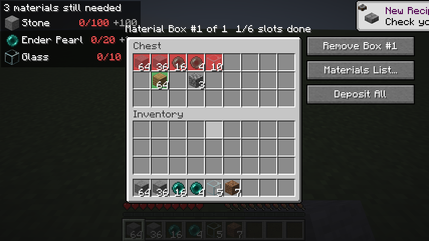
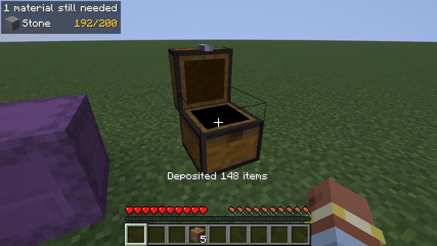

# Material Boxes

A client-side Fabric mod for Minecraft 26.2 that turns a build's material list into a checklist you can see in the world.

Load your list by pasting it, importing a Litematica export, or letting Claude read a screenshot. Then mark chests, barrels or shulker boxes as **Material Boxes**. Their slots are color-coded: red for what's missing, yellow for partial stacks, green for done. Shift-click and **Deposit All** put each item in its slot, and a HUD shows what's still needed and how much you're carrying. Box counts refresh on their own when you're nearby, even if someone else added items while you were away. Named lists are saved across worlds. The mod only uses normal player actions, so it works on any server without being installed there.





## Features

- **Import lists** from free-form text ("64 stone", "3 stacks oak planks"), Litematica `.txt` / `.csv` exports, or screenshots read by Claude (optional, uses your own API key).
- **Material Boxes:** color-coded slots, hover tooltips with progress, and highlights that follow items wherever you put them. Items inside shulker boxes count too.
- **Shift-click routing and Deposit All** put exactly the amount each slot needs.
- **Missing materials HUD** in full or compact size. Toggle it with **H**.
- **Auto-refresh:** boxes that may have changed are read in the background when you're within reach.
- **Ready to build:** hide the slot highlights with one click, or cross off materials you're done with without removing them.
- **Saved lists,** each with its own Material Boxes, shared across worlds.
- **Tidies up by itself:** boxes you break are removed, boxes that disappear any other way are kept as missing until you clear them, double chests are followed, and picked-up shulker boxes reconnect when placed again.
- **Shulker box preview** for shulker boxes in your inventory.

## Requirements

- Minecraft 26.2
- Fabric Loader 0.19.5 or newer
- [Fabric API](https://modrinth.com/mod/fabric-api)
- Java 25
- Optional: [Mod Menu](https://modrinth.com/mod/modmenu), for a settings button in the mods list

## Installation

1. Download the latest `material-boxes-<version>.jar` from the [Releases](../../releases) page.
2. Put it and Fabric API in your `.minecraft/mods` folder.
3. Launch Minecraft with the Fabric profile.

## Quick start

1. Press **B** (or type `/materials`) to open the Materials List.
2. Paste your list into the import panel, or click **Litematica** to load an export, then click **Replace**.
3. Open a chest and click **+ Material Box**. Red slots show what goes there.
4. Fill the slots by shift-clicking items in, or click **Deposit All**.
5. Watch the HUD while you gather. Press **H** to hide or show it.

Settings are in the Materials List (the comparator button), under `/materials settings`, or in Mod Menu.

## Documentation

Full user docs are in [`docs/`](docs/README.md):

- [Importing a material list](docs/importing-lists.md)
- [Material Boxes](docs/material-boxes.md)
- [The Materials List screen](docs/materials-list.md)
- [Saved lists](docs/saved-lists.md)
- [Missing materials HUD](docs/hud.md)
- [Shulker box preview](docs/shulker-preview.md)
- [Settings, controls and files](docs/settings-and-controls.md)
- [Compatibility and limitations](docs/compatibility.md)

## Building from source

You need a JDK 25. Point `JAVA_HOME` at it, then run:

```bash
./gradlew build
```

The mod jar is `build/libs/material-boxes-<version>.jar`. Ignore the `-gametest` jar next to it.

Other tasks:

| Command | What it does |
|---|---|
| `./gradlew test` | Unit tests (material parsing and item matching) |
| `./gradlew runClient` | Starts a dev client with the mod |
| `./gradlew runClientGameTest` | Plays through the mod in a real client and singleplayer world, saving screenshots to `build/run/clientGameTest/screenshots/` |
| `./gradlew prodClientGameTest` | The same game test, against the built jar in a production Fabric install |

## License

[MIT](LICENSE)
